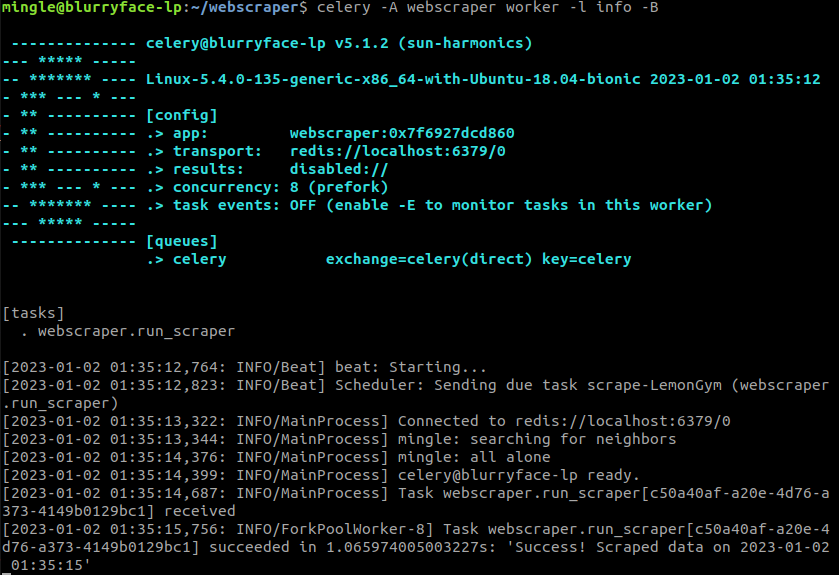

# webscraper
Trying to build a webscraper tool that can be deployed on a webserver.

Currently, the web scraper scrapes the occupancy rate at my preferred Gym.

## Requirements
    pip install beautifulsoup4
    pip install requests
    pip install celery


## How to deploy on a local server
---

1. Install **Redis** on Linux / WSL
    ```
    sudo apt-get install redis 
    ```

    Redis (Remote Dictionary Server) is an in-memory data structure store that can be used as a database, cache, and message broker. 

    Another alternative is **RabbitMQ**. 

2. Start the Redis server using the CLI command
    ```
    redis-server
    ```

3. Launch the webscraper using Celery. 
    For more info on setting up Celery go here ->[First Steps with Celery](https://docs.celeryq.dev/en/stable/getting-started/first-steps-with-celery.html)
    ```
    celery -A webscraper worker -l info -B
    ```

    

## How to deploy on a web server
---
TBA


